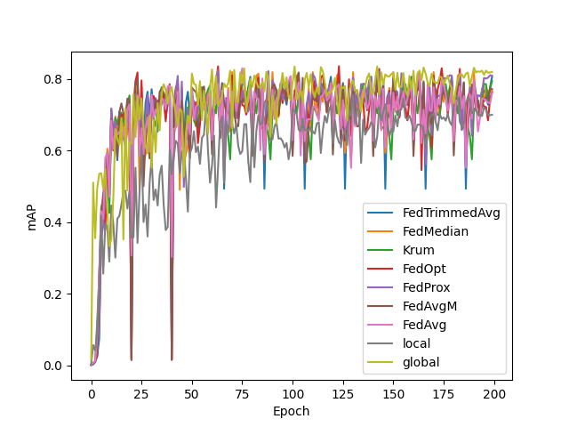

# FLYOLO
A federated learning YOLO framework. Design based on **ultralytics** (YOLO) and **flower** (Federated Learning).

## Install
```console
git clone https://github.com/ffyyytt/FedYOLO.git
pip install requirements.txt
```

## Federated Learning
```console
python3 ./mainFL.py -clients "shipsGE/s0.yaml" "shipsGE/s1.yaml" -group "shipsGE/shipsGE.yaml" -strategy "FedAvg"
```

Parameters:
- clients: list of clients `yaml` files.
- group: `yaml` file of group dataset.
- rounds: number of rounds (default: 10)
- epochs: number of local epochs (default: 20)
- imgsz: Image size (default: 512)
- batch: Batch size (default: 16)
- model: Backbone model (default: yolov8n.pt)
- strategy: Federated Learning method, check supported strategies. (default: "FedAvg")

Supported strategies:
- FedAvg
- FedAvgM
- FedTrimmedAvg
- FedMedian
- Krum
- FedOpt
- FedProx
- FedNova

## YOLO running
```console
python3 ./main.py -data "ship_v0/planet.yaml"
```

Parameters:
- data: `yaml` file of dataset.
- rounds: number of rounds (default: 10)
- epochs: number of local epochs (default: 20)
- imgsz: Image size (default: 512)
- batch: Batch size (default: 16)
- model: Backbone model (default: yolov8n.pt)

## Evaluate
```console
python3 ./test.py -data "ship_v0/planet.yaml" -split "val" -model "model.pt" -output "predict"
```

Parameters:
- data: `yaml` file of dataset.
- split: val, test, train
- imgsz: Image size (default: 512)
- batch: Batch size (default: 16)
- model: Model weight (default: model.pt)
- output: Folder Output (default: predict)

## Show results
```console
python3 ./plot.py -dataset "ship_v0" -group "group4"
```
```console
python3 ./plot.py -dataset "shipsGE" -group "shipsGE"
```

Parameters:
- dataset: dataset folder (default: "ship_v0")
- group: folder of group (default: "group4")

<a></a>

## Split dataset
Example of how to split a dataset: split.py
```console
python3 ./split.py -n_splits 4
```
Parameters:
- n_splits: Number of subset. (default 4)
- seed: Random seed. (default: 1312)
